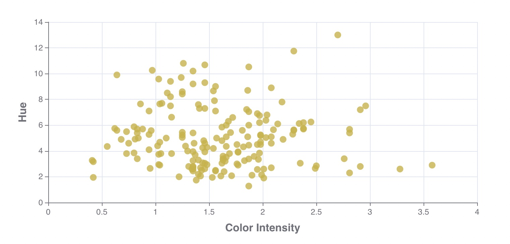
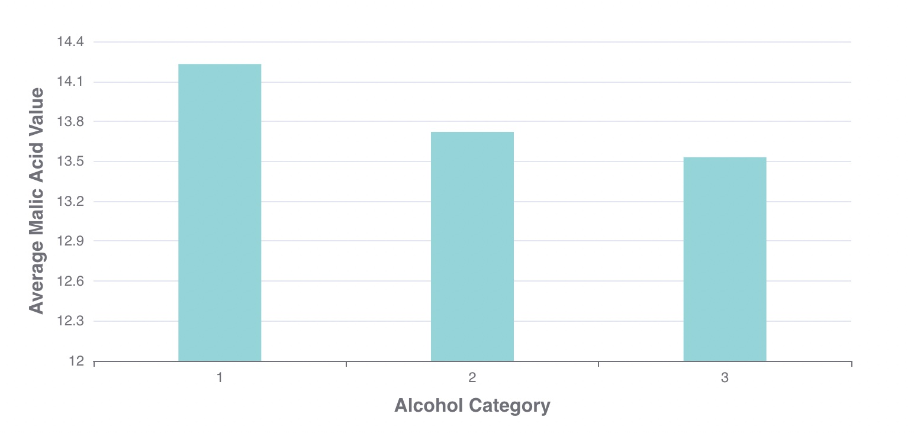

# echarts-demo

Steps to run project:

1. git clone https://github.com/FarazIITK/echarts-demo.git
2. cd client
3. yarn install
4. yarn start

Scatter-chart would look like this:

Bar chart would like this:

